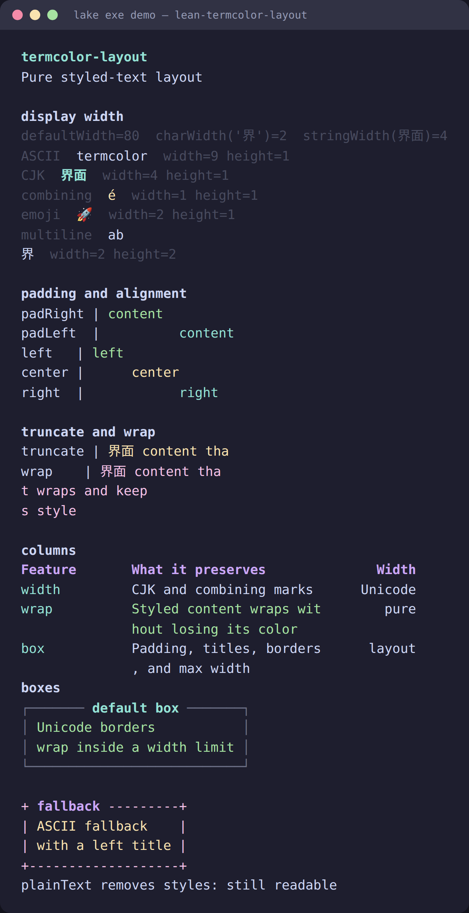

# lean-termcolor-layout

[](https://github.com/jonaprieto/lean-termcolor-layout/actions/workflows/ci.yml)
[](https://github.com/jonaprieto/lean-termcolor-layout/releases)
[](lean-toolchain)
[](https://jonaprieto.github.io/lean-termcolor-layout/)
[](LICENSE)

Pure display-width measurement and layout for [`termcolor`](https://github.com/jonaprieto/lean-termcolor).
Styles remain attached to `Text`; no terminal IO or escape emission occurs here.

<p align="center"></p>

## Development

This project is maintained by its author with AI-assisted development tools.
Changes are reviewed, tested, and remain the maintainer's responsibility.

## Provides

Display-cell width, truncation, wrapping, padding, alignment, columns, boxes, `splitLines`, and
`joinLines`. The default width is 80 columns until a caller supplies a terminal width.

```lean
import TermColor.Layout

open TermColor TermColor.Layout

def message : Text := Text.styled "界面" Style.bold
#eval Text.width message
#eval (wrapLines 3 message).plainText
```

## Build

```sh
lake build TermColor.Layout TermColor.Layout.Properties demo
lake exe demo
```

## Related projects

Used by [`termcolor-widgets`](https://github.com/jonaprieto/lean-termcolor-widgets),
[`termcolor-terminal`](https://github.com/jonaprieto/lean-termcolor-terminal), and
[`argus`](https://github.com/jonaprieto/lean-argus). Diagnostics are provided by
[`termcolor-diagnostics`](https://github.com/jonaprieto/lean-termcolor-diagnostics).

## License

Apache-2.0.
